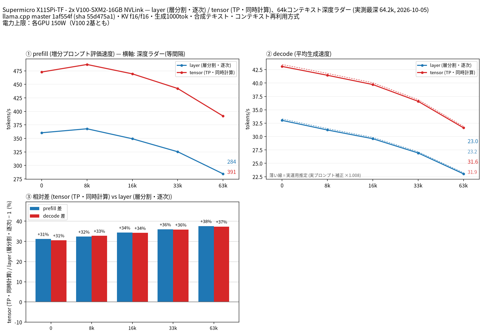

# Tesla V100 16GB ×2・NVLink・各150W制限でQwen3.8 27Bのsplit-modeを比較

- **作成者**: KotaroFurukawa
- **作成日**: 2026-10-05

## 概要

V100-SXM2-16GB 2基（ベースボード1枚）をNVLinkで接続し、Qwen3.8-27B Q4_K_Mのlayer / tensor分割を64kコンテキストまで比較しました。
**全結果は、各V100の電力上限を150Wに設定した条件です（2基とも150W）。** 測定中の両GPUの`power.limit`と`enforced.power.limit`は全保存標本で150Wを維持しました。
生成はtensorがlayerより30.5〜37.3%、入力処理も31.2〜37.6%速い結果でした。最深段は実入力64,226トークン＋1,000生成を両モードで完了しました。

## ハードウェア

| 項目 | 内容 |
|------|------|
| コンピュータ / マザーボード | Supermicro X11SPi-TF |
| GPU | Tesla V100-SXM2-16GB × 2（VRAM 16GB / 基、ベースボード1枚） |
| GPU電力上限 | **150W / GPU（両V100とも）**。条件の途中変更なし |
| GPU 接続 | PEX88048 PCIeスイッチ経由、ホスト上流Gen3 x16を共有、GPU側各Gen3 x16。GPU間NVLinkあり（topoのNV6）。Gen3 x16は事前の受け入れ検証で確認、NV6は今回も確認 |
| CPU | Intel Xeon Silver 4108（8コア / 16スレッド）、CPUソケット1基 |
| メモリ | OS認識約30.0GiB（MemTotal 31,473,732KiB）、種類不明 |

## ソフトウェア環境

| 項目 | 内容 |
|------|------|
| OS | Ubuntu 24.04.5 LTS / Linux 6.8.0-142-generic |
| GPU ドライバ | NVIDIA 580.178.04 |
| llama.cpp | `1af554f8fc78ba029665a47b839484d9763e2a75`、CUDA12.8.1 / SM70 / NCCL2.26.5付きビルド |

## ベンチマーク

### 条件

| 項目 | 内容 |
|------|------|
| ツール | [llama-split-bench](https://github.com/kuraneko1/llama-split-bench)、`7af72d4085aa5073677d41389144112dd94fcb74` |
| モデル | Qwen3.8-27B-Q4_K_M.gguf、16,810,714,336byte（15.66GiB） |
| モデルSHA-256 | `e00082f779fa385cee8c68a3ec8833a75778cc87272240b942f74e0b8243e520` |
| 測定モード | layer / tensor、CUDA0+CUDA1、全層GPU。tensor比率1/1。単一GPUは今回未実施 |
| ctx / stages | 65,536 / 0,8192,16384,32768,63488 |
| KV キャッシュ | F16 / F16 |
| 投機的デコード | なし |
| その他 | FA on、thread8、batch512 / ubatch128、1 slot、各段1,000生成（ignore_eos）、RAM prompt cache0、context shiftなし |
| 監視 | GPU/HBM各70℃停止の既存監視下、有限ジョブで実行。8k smoke成功後に64k本計測、約14.2分 |

### 結果

単位token/s。depthは実入力トークン数で、prefillは共通prefixを再利用しながら追加した入力の処理速度です。depth 0のprefillには別途fresh promptのpp2048（実入力1,978）の値を使用し、ラダー初段の11 token prefillは表に載せていません。

| 実入力depth | prefill layer | prefill tensor | decode layer | decode tensor |
|------------:|--------------:|---------------:|-------------:|--------------:|
| 0（実入力11） | 360.5 | 472.8 | 33.03 | 43.10 |
| 8,077 | 367.8 | 486.8 | 31.23 | 41.45 |
| 16,437 | 349.4 | 469.5 | 29.60 | 39.72 |
| 33,252 | 325.3 | 442.4 | 26.94 | 36.59 |
| 64,226 | 284.5 | 391.4 | 23.04 | 31.64 |

グラフの横軸はツール既定の目標depthを等間隔で示しています。正確な入力数は表・JSONを参照してください。10要求全て1,000 token生成、入力縮小の再試行・コンテキスト切捨てなしでした。

新規入力（cache_prompt=false）のprefill：

| 目標入力token | 実入力token | layer | tensor |
|--------------:|------------:|------:|-------:|
| 512 | 512 | 332.0 | 405.1 |
| 2048 | 1,978 | 360.5 | 472.8 |
| 8192 | 8,077 | 366.0 | 493.4 |

付属の実プロンプト代理課題3件（tensor、temperature0.7 / top_p0.9）：

| 課題 | 入力token | 出力token | decode token/s |
|------|----------:|----------:|---------------:|
| design | 73 | 1200 | 43.44 |
| review | 58 | 1200 | 43.54 |
| qa | 61 | 1200 | 43.43 |

図の破線は、これら3件と浅い合成入力の速度比（係数1.008）を全depthに適用した推定です。長文コードで直接測った速度ではありません。いずれもnative completionで、回答品質の採点は行っていません。

### 所感

- この単一要求・Q4・各150Wの条件では、生成・入力処理ともtensorが有利でした。反復によるばらつきや複数同時要求は未評価です。
- [既存のV100 16GB×2報告](2026-09-23_060231_comparing_split_modes_of_qwen3.8_27b_on_2x_tesla_v100.md)と異なり、入力処理でもtensorが速い結果でした。ただしNVLink/NCCLの有無、モデル・量子化、KV形式、ビルド、電力上限が異なるため、差をNVLinkだけの効果とは断定できません。
- 計測中の最高GPU温度は50℃、最高HBM温度は54℃。取得したECC total・退役件数・NVLinkエラーは0、前後のPCIe13項目は両GPUとも増分0でした。終了後はGPU無負荷を確認しました。

## 添付

- [argv-layer.txt](attachment/2026-10-05_203331_comparing_qwen3_8_27b_split_modes_on_2x_v100_nvlink_at_150w/argv-layer.txt)
- [argv-tensor.txt](attachment/2026-10-05_203331_comparing_qwen3_8_27b_split_modes_on_2x_v100_nvlink_at_150w/argv-tensor.txt)
- [results-layer-pp0.json](attachment/2026-10-05_203331_comparing_qwen3_8_27b_split_modes_on_2x_v100_nvlink_at_150w/results-layer-pp0.json)
- [results-layer.json](attachment/2026-10-05_203331_comparing_qwen3_8_27b_split_modes_on_2x_v100_nvlink_at_150w/results-layer.json)
- [results-real.json](attachment/2026-10-05_203331_comparing_qwen3_8_27b_split_modes_on_2x_v100_nvlink_at_150w/results-real.json)
- [results-tensor-pp0.json](attachment/2026-10-05_203331_comparing_qwen3_8_27b_split_modes_on_2x_v100_nvlink_at_150w/results-tensor-pp0.json)
- [results-tensor.json](attachment/2026-10-05_203331_comparing_qwen3_8_27b_split_modes_on_2x_v100_nvlink_at_150w/results-tensor.json)
- [run-info.json](attachment/2026-10-05_203331_comparing_qwen3_8_27b_split_modes_on_2x_v100_nvlink_at_150w/run-info.json)
- [split-bench-en.png](attachment/2026-10-05_203331_comparing_qwen3_8_27b_split_modes_on_2x_v100_nvlink_at_150w/split-bench-en.png)
- [split-bench-ja.png](attachment/2026-10-05_203331_comparing_qwen3_8_27b_split_modes_on_2x_v100_nvlink_at_150w/split-bench-ja.png)

公開用に、run-info/argvの実行ファイル・モデル保存先を一般化し、argvのbind先をlocalhost表記に置換しました。ラダーJSONのgpu_before/gpu_after診断文字列は除外し、測定数値は原本と一致させています。図は同じ保存JSONから各GPU150W制限を追記して再描画したものです。
